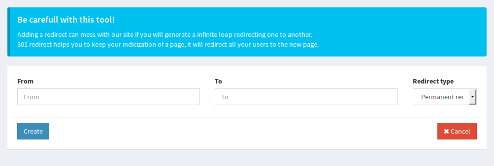

# asgardcms-redirect
Module for AsgardCMS that add the possibility to manage redirect within the app itself.

# How to use
You need to add a new middleware on the global group.
Open `config/asgard/core/core.php` and add `check-redirect` middleware in `middleware.frontend` group.
You should have something like:

```
'middleware' => [
       'backend' => [
           'auth.admin',
       ],
       'frontend' => [
           'check-redirect',
       ],
       'api' => [
           'api',
       ],
    ],
```
In this way each request will be checked by the module and it will perform the redirect if needed.

# Screenshots



